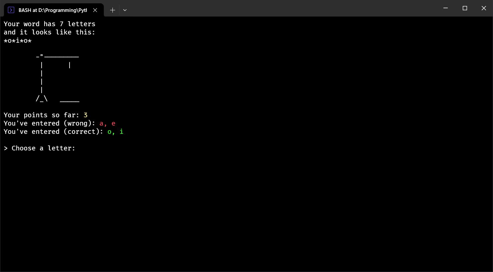

[ ARCHIVE PROJECT @ 2019 ]

# HANGMAN 💀

## About
One of my oldest programs I managed to dig up from the abyss of oblivion. \
Simple digital version of the primary school classic. \
The goal of the game is to guess the keyword making as few mistakes as possible!

## Usage Instructions
### Run
Run the program for example via a command `python3 "hangman game.py"` or `py "hangman game.py"`.

### Gameplay
Program picks a keyword randomly from the *"hangman words.txt"* file.

> [!WARNING]
> Set of words to choose from *"hangman words.txt"* consists of only polish words!

Then it is your role to guess the keyword typing in letters one by one. \
Your only concern being to watch out for the number of misguesses, as too many (8) will lose you the round.

And the fun continues, wheter you win or not.

### Controls
| KEYS                              | ACTION          |
| ----                              | ------          |
| from <kbd>A</kbd> to <kbd>Ź</kbd> | Choose a letter |
| <kbd>esc</kbd>                    | Exit the app    |

## Screenshots

